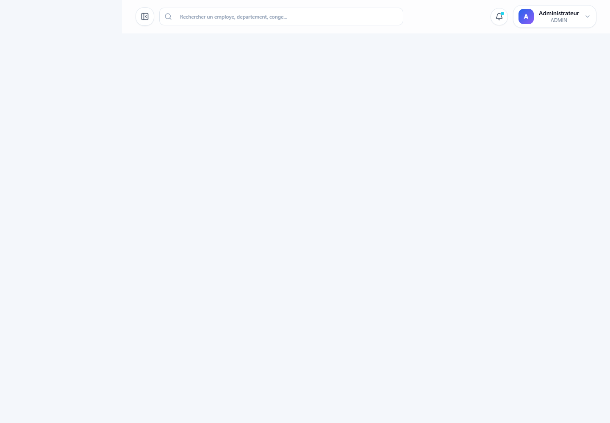

# Gestion RH

Application web de gestion des ressources humaines avec Spring Boot, React et PostgreSQL.



## Structure

```text
Gestion RH/
  backend/     API REST Spring Boot, JWT, JPA, PostgreSQL
  frontend/    Interface React, routes protegees, Axios, Tailwind CSS
  database/    Script SQL et donnees de test
```

## Fonctionnalites

- Authentification JWT avec roles `ADMIN`, `RH`, `EMPLOYE`
- Gestion des utilisateurs
- Gestion des employes
- Gestion des departements
- Demandes de conges avec validation/refus
- Generation de fiches de paie et export PDF simple
- Dashboard et reporting

## Captures Portfolio

Les captures sont dans `portfolio-screenshots/` :

- Login : `portfolio-screenshots/01-login.png`
- Dashboard : `portfolio-screenshots/02-dashboard.png`
- Employes : `portfolio-screenshots/03-employees.png`
- Conges : `portfolio-screenshots/04-leaves.png`
- Paie : `portfolio-screenshots/05-payrolls.png`
- Utilisateurs : `portfolio-screenshots/06-users.png`
- Mobile : `portfolio-screenshots/07-mobile-dashboard.png`

## Prerequis

- Java 17+
- Maven 3.9+
- Node.js 18+
- PostgreSQL 14+

## Base de donnees

Creer la base :

```sql
CREATE DATABASE gestion_rh;
```

Puis importer :

```bash
psql -U postgres -d gestion_rh -f database/schema.sql
```

## Backend

Configurer si besoin `backend/src/main/resources/application.yml`.

Lancer :

```bash
cd backend
mvn spring-boot:run
```

API disponible sur `http://localhost:8080`.


Compte de test :

- Email : `admin@gestionrh.com`
- Mot de passe : `admin123`

## Frontend

Installer et lancer :

```bash
cd frontend
npm install
npm run dev
```

Interface disponible sur `http://localhost:5173`.

## API principales

- `POST /api/auth/login`
- `POST /api/auth/register`
- `GET /api/employees`
- `POST /api/employees`
- `PUT /api/employees/{id}`
- `DELETE /api/employees/{id}`
- `GET /api/departments`
- `POST /api/departments`
- `GET /api/leaves`
- `POST /api/leaves`
- `PUT /api/leaves/{id}/approve`
- `PUT /api/leaves/{id}/reject`
- `GET /api/payrolls`
- `POST /api/payrolls/generate`
- `GET /api/reports/dashboard`

## Explication simple

Le backend expose une API REST securisee par JWT. Les donnees sont stockees avec Spring Data JPA dans PostgreSQL. Le frontend React consomme cette API avec Axios, garde le token JWT dans `localStorage`, et protege les pages selon le role connecte.
